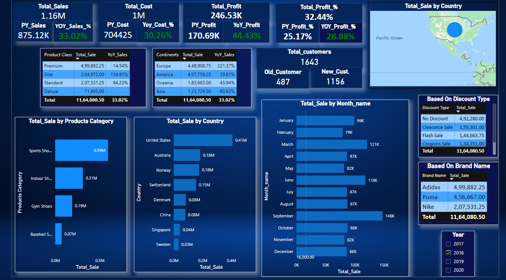
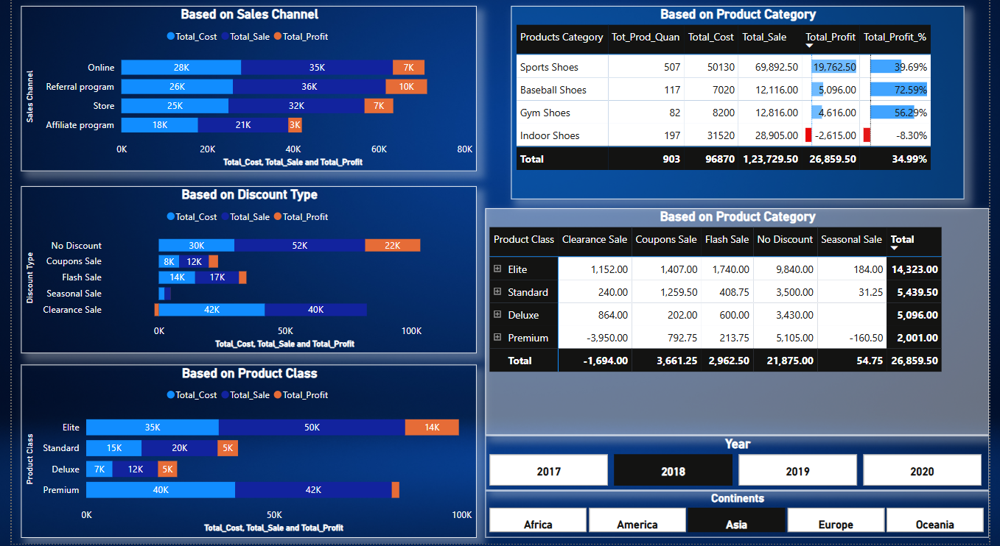
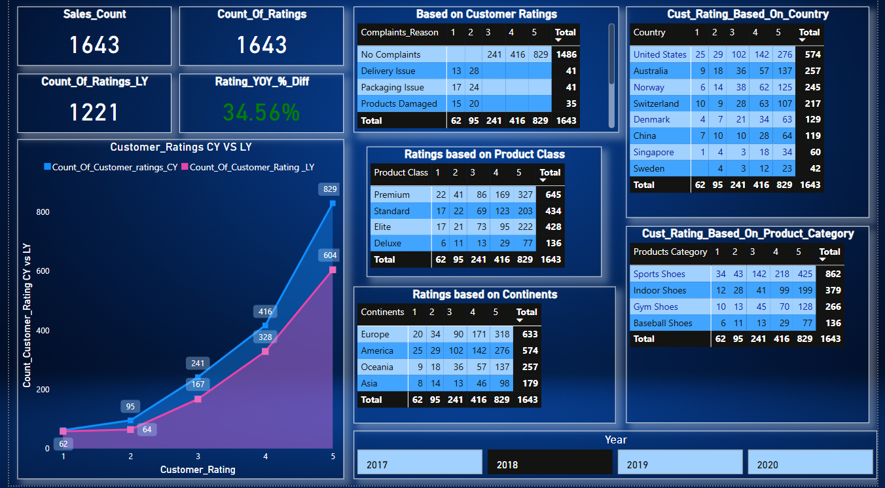

# Power BI Sales Dashboard 📊

This project showcases a *Power BI dashboard* built using Excel-based sales data.  
It focuses on deriving actionable insights by analyzing sales performance, tracking profits and losses, studying discount impacts, and evaluating customer satisfaction.

---

## 🧠 About the Project

The goal of this dashboard is to simulate real-world business reporting and help stakeholders make data-driven decisions.  
The analysis spans   Shoes product categories and covers key performance indicators such as revenue, discount types, and customer feedback.

---

## 🔑 Key Features of the Dashboard

- 📈 *Sales Trend Analysis* — Month-over-month sales and profit performance
- 📊 *Category-wise Revenue Insights* — Revenue, quantity sold, and profit across product lines
- 🎯 *Discount vs Profit Analysis* — Impact of different discount strategies on profitability
- 🌍 *Region-wise Sales Overview* — Sales distribution by location and channel
- 😊 *Customer Satisfaction Metrics* —satisfaction by contries,categories etc.

---

## 🛠 Tools & Technologies Used

- *Power BI* — Data modeling, DAX calculations, and dashboard creation  
- *Excel* — Data source and preprocessing  
- *DAX (Data Analysis Expressions)* — Custom calculations and KPIs  
- *GitHub* — Project version control and presentation

---

## 🧰 Skills Demonstrated

- Data Cleaning and Preprocessing  
- Data Modeling and Relationship Design in Power BI  
- Writing Custom Measures Using DAX  
- Creating Interactive Visualizations  
- Business Analytics & Insight Communication  
- Version Control using Git & GitHub

---

## 👁‍🗨 How to View the Dashboard

> Power BI .pbix files can't be rendered directly on GitHub. Here's how you can explore the dashboard:

1. *Preview Key Screenshots Below*
2. **Want to explore it live or need the .pbix file?**  
   👉 Message me on [LinkedIn](https://www.linkedin.com/in/aparnagirnale) — I’ll be happy to share it!
3. You can also download the dataset (.xlsx) and try building it yourself in Power BI!

---

## 📸 Dashboard Previews

### 🌍 Global Sales Performance

### 💰 Revenue Engine Dashboard

### 😊 Customer Satisfaction Overview

---

## 📂 Files Included

- Sales Dataset_For_Self_Project.xlsx — Excel data source  
- Global_Sales_Performance.png — Dashboard visual  
- Revenue_Engine_Dashboard.png — Revenue insights  
- Customer_Satisfaction_Overview.png — Customer satisfaction insights  
- README.md — Project summary & documentation  
- LICENSE — License file for reuse clarity

---

⭐ *If you found this project interesting, feel free to star ⭐ the repo and connect with me on LinkedIn!*
